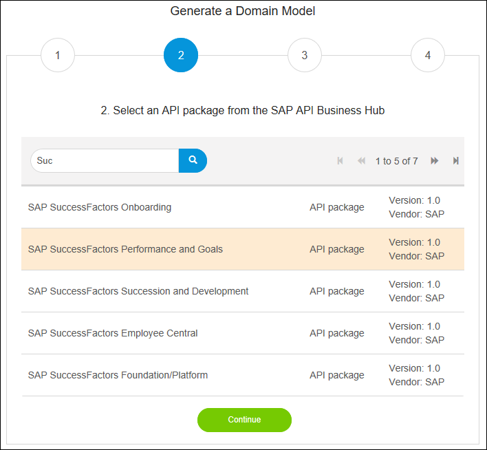
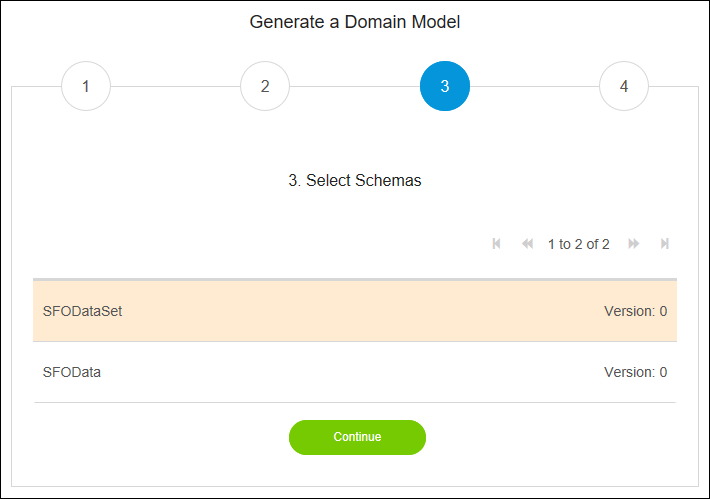
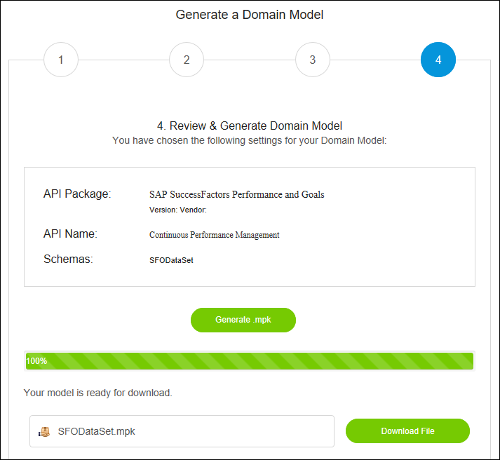
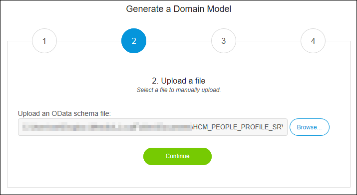
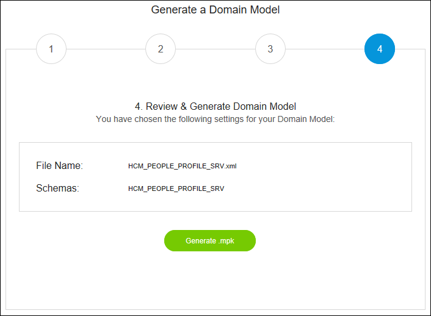
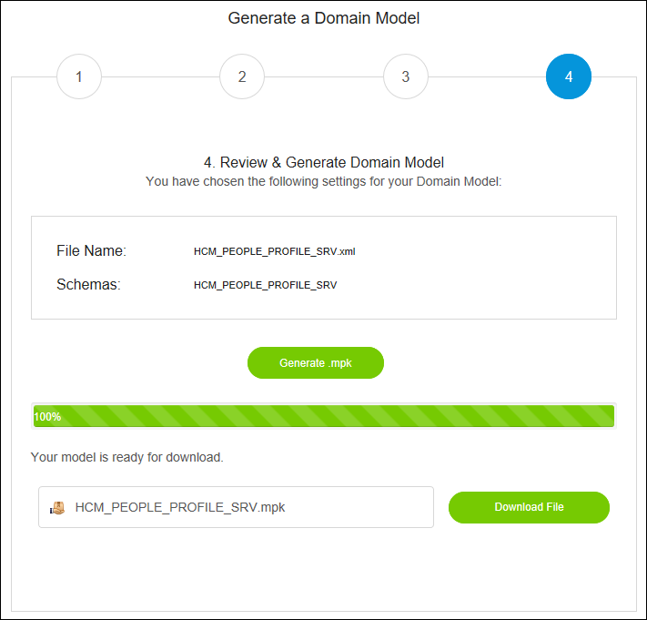
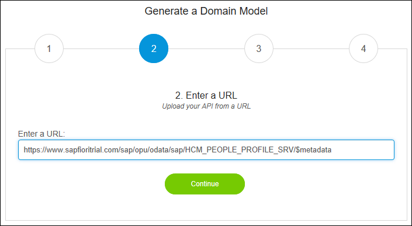
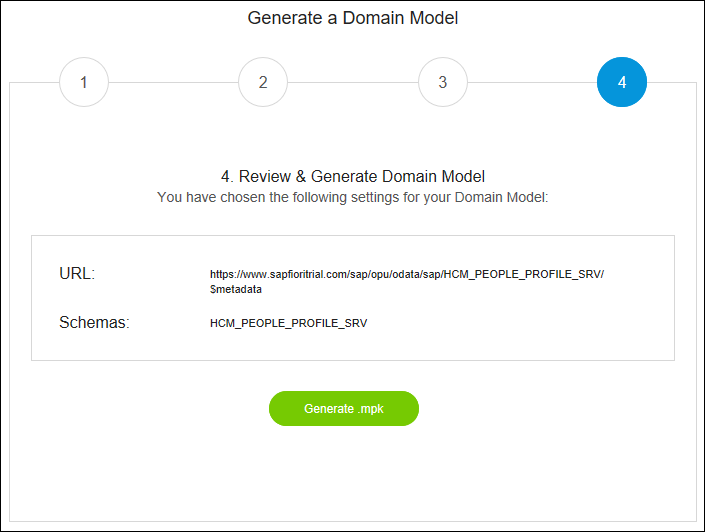
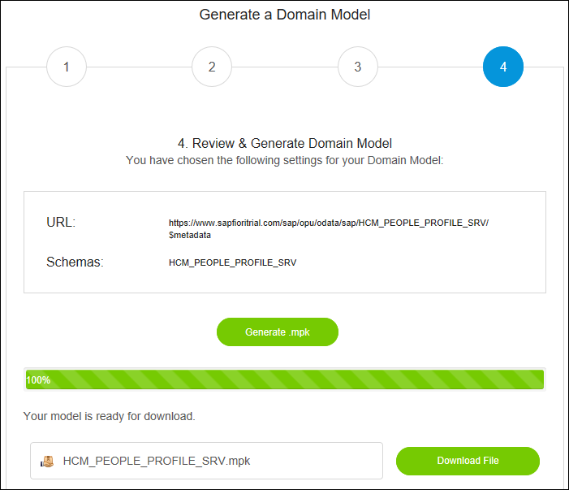

## 1 Introduction

SAP data models reflect an OData service from SAP back-end systems like SAP Business Suite (SAP ERP 6.0), SAP S/4HANA, and SAP S/4HANA Cloud. OData services are exposed via the SAP Gateway and are described in a `$metadata` file, which describes all the entities, relationships, and functions that are exposed for that service.

Handcrafting a Mendix domain model for these OData services would be a lot of work. The SAP OData Model Creator automates this process by creating a Mendix module for the selected service containing the Mendix domain model which can be imported in your project. The data model also contains additional information such as the URL of the exposed endpoint, a list of collections in the service, and a list of functions provided by the service.

There are three ways to create the data model:

* [Using the API Business Hub](#APIBusHub)
* [Uploading an Odata Metadata XML File](#Uploading)
* [Providing the URL to the Metadata](#URL)

## 2 Prerequisites

Before starting this how-to, make sure you have completed the following prerequisites:

* Identify the SAP back-end system and OData service you wish to use
* Create the app in the Mendix Desktop Modeler 7.5.1 or higher

## 3 Generating a Data Model

The SAP OData Model Creator is an app in the App Store. Search for it in the Mendix App Store, or find it here: [SAP OData Model Creator](https://sapodatamodelcreator.mendixcloud.com/). 

{}
The SAP OData Model Creator is not currently available in the App Store within the Desktop Modeler. It can only be run in a browser.
{}

1. Open the [SAP OData Model Creator](https://sapodatamodelcreator.mendixcloud.com/).

You will be asked how you want to generate your model.

There are three ways to generate your data model.

* If your SAP back-end system stores the OData API package on the SAP API Business Hub, then you can create the data model from there; select **API Business Hub** as the source and continue with section [3.1 Using the API Business Hub](#APIBusHub)
* If you have access to the metadata file, select **Manual** and continue with section [3.2 Uploading an Odata Metadata XML File](#Uploading)
* If you have the metadata URL for the OData service, select **URL** and continue with section [3.3 Providing the URL to the Metadata](#URL)

### 3.1 Using the API Business Hub

Your SAP back-end OData API is held in the API Business Hub.

{}
There may be several schemas in the packages of an API. Each of these will generate a module. Depending on the functionality of your app, you may have to generate several modules and import all of them into your app.
{}

1. Click **API Business Hub**.

    You will be presented with a list of packages containing OData API definitions. You can search this list (this includes text in the package description as well as the package name), and page through it using the paging buttons.

    

    {}You can return to any stage in this process by clicking on the relevant step number.
    {}

2. Click the package you want. It will be highlighted.

3. Click **Continue** to see the APIs within the package.

    

    {}This will be shown even if only one API exists.
    {}

4. Click the API you want. It will be highlighted.

5. Click **Continue** to see the schemas within the API.

    

    {}This will be shown even if only one schema exists.
    {}

6. Click the schema you want. It will be highlighted.

7. Click **Continue** to proceed to the confirmation screen.

    

8. Click **Generate .mpk** to generate the data model module.

    

9. Click **Download File**.

    Your browser will offer options on what to do with the file.

10. Save the file locally. It is recommended that you save it in the **resources** folder of your Mendix app so that you can find it easily.

You have now created the module. Section [4 Using the Data Model Module in a Mendix App](#Using) explains how to import it into your app.

### 3.2 Uploading an Odata Metadata XML File

You may want to generate the data model by hand using the `$metadata` file directly. This may, for example, not be in the API Business Hub.

One way to do this is by getting the OData metadata XML file. This file can be download from the OData service URL directly using the `$metadata` suffix. The browser will display the xml and you can use the right mouse button in most browsers to choose to download the xml file. Save the file locally. It is recommended that you save it in the **resources** folder of your Mendix app so that you can find it easily.

To try this you could use the publicly available HCM People Profile service, for which [https://www.sapfioritrial.com/sap/opu/odata/sap/HCM_PEOPLE_PROFILE_SRV/$metadata](https://www.sapfioritrial.com/sap/opu/odata/sap/HCM_PEOPLE_PROFILE_SRV/$metadata) is the metadata file.

1.  Download the xml metadata file to your local drive.

    

2. Open the SAP Odata Model Creator

    

3. Click **Manual**.

    

4. Click **Browse** and navigate to the xml file you want to use.

5. Select the xml file you want to use.

6. Click **Continue** to see the schemas within the metadata.

    

    {}This will be shown even if only one schema exists.
    {}

7. Click the schema you want. It will be highlighted.

8. Click **Continue** to proceed to the confirmation screen.

    
    
9. Click **Generate .mpk**. A progress bar will be shown during the parsing and generation of the module.

10. Once the generation is complete, the **Download File** button appears. Notice that the file name of your data model module is extracted from the metadata file itself.

    

11. Click **Download File**.

    Your browser will offer options on what to do with the file.

12. Save the file locally. It is recommended that you save it in the **resources** folder of your Mendix app so that you can find it easily.

You have now created the module. Section [4 Using the Data Model Module in a Mendix App](#Using) explains how to import it into your app.

### 3.3 Providing the URL to the Metadata

You can also generate the data model from the metadata by providing the URL to the SAP OData Model Creator. You can try this using the publicly available HCM People Profile service, for which [https://www.sapfioritrial.com/sap/opu/odata/sap/HCM_PEOPLE_PROFILE_SRV/$metadata](https://www.sapfioritrial.com/sap/opu/odata/sap/HCM_PEOPLE_PROFILE_SRV/$metadata) is the metadata file.

{}
This method does not work where the destination needs authentication. You cannot use it, for example, to generate a data model for a service on the ES5 Netweaver Gateway Demo.
{}

1. Click **URL** on the first page of the SAP OData Model Creator.

    

2. Enter the URL of the service metadata which you want in **Enter a URL**.

3. Click **Continue** to see the schemas within the metadata.

    

    {}This will be shown even if only one schema exists.
    {}

4. Click the schema you want. It will be highlighted.

5. Click **Continue** to proceed to the confirmation screen.

    
    
6. Click **Generate .mpk**. A progress bar will be shown during the parsing and generation of the module.

7.  Once the generation is complete, the **Download File** button appears. Notice that the file name of your data model module is extracted from the metadata file itself.

    

8. Click **Download File**.

    Your browser will offer options on what to do with the file.

9. Save the file locally. It is recommended that you save it in the **resources** folder of your Mendix app so that you can find it easily.

You have now created the module. Section [4 Using the Data Model Module in a Mendix App](#Using) explains how to import it into your app.

## 4 Using the Data Model Module in a Mendix App

Now you have a Mendix module ready to import into your project.

1. Open the project which you created as a prerequisite.

2. Right-click your project in the **Project Explorer** and select **Import module package...**.

    

3. Use the navigation dialog to find your module, which will have the suffix **.mpk**.

    You now have your service **HCM\_PEOPLE\_PROFILE\_SRV** module available in your project ready to use in combination with the SAP OData Connector.

    

For more information on how to use the imported data model together with the SAP OData Connector, see [How to Use the SAP OData Connector](/howto/sap/use-sap-odata-connector).

## 5 Related Content

* [HCM People Profile Service sample metadata](https://www.sapfioritrial.com/sap/opu/odata/sap/HCM_PEOPLE_PROFILE_SRV/$metadata)
* [How to Use App Store Content in the Modeler](/community/app-store/use-app-store-content-in-the-modeler)
* [How to Use the SAP OData Connector](/howto/sap/use-sap-odata-connector)
* [SAP OData Connector](https://appstore.home.mendix.com/link/app/74525/Mendix/SAP-OData-Connector)
* [SAP OData Model Creator](https://sapodatamodelcreator.mendixcloud.com/)
