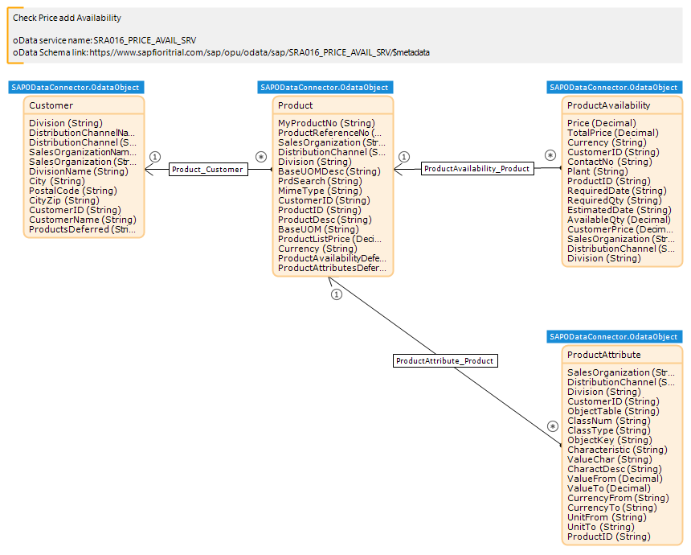

## 1 Introduction

Mendix apps can consume OData services exposed by SAP back-end systems. To do this you need to use the SAP OData Connector.

The SAP OData Connector needs to know details of the OData service which has been exposed. This involves mapping the data structures exposed by the OData service (via the $metadata URL) to entities and attributes of the domain model. This information is created as a Mendix module (.mpk) file which can be imported into your Mendix app.

Any OData service can be used to generate a data model using the SAP OData Model Creator. See [How To Use the SAP OData Model Creator](/howto/sap/use-sap-odata-model-creator) for instructions on how to do this.

To accelerate the consumption of the SAP Business Suite services, Mendix also provides the full set of Business Suite for SAP Fiori Cloud apps as modules in the Mendix App Store. See section [3 SAP Data Models in the App Store](#appstoremodels).

## 2 SAP Data Models

The Data Model module contains up to four resources which help to consume the OData Service:

* Domain Model
* Service Root
* Entity Set Names
* Function Names

### 2.1 Domain Model

Each Mendix SAP data model (previously referred to as "service modules") has a domain model that describes the information in the OData service. The domain model consists of entities and their relations represented by associations. For more information, see [Domain Model](../domain-model) in the Mendix Reference Guide.

### 2.2 Service Root

The module contains a constant whose value is the service root of the OData service. For the **Check Price and Availability for Field Sales Representative** this is the constant SRA016_PRICE_AVAIL_SRV and has the value `https://www.sapfioritrial.com/sap/opu/odata/sap/SRA016_PRICE_AVAIL_SRV`.

### 2.3 Entity Set Names

The enumeration **EntitySetNames** contains a list of the collections in the service. These are entities which can be queried to produce a list of matching objects.

### 2.4 Function Names

The enumeration **FunctionNames** contains a list of functions which are exposed by the OData service. To assist in using these functions the domain model will also include an entity for each function, suffixed with the string *Parameters*, which is used to provide the required parameters to the function.

## 3 SAP Data Models in the App Store

To accelerate the consumption of the SAP Business Suite services, Mendix also provides the full set of Business Suite for SAP Fiori Cloud apps as modules in the Mendix App Store. Each **SAP Data** module in the App Store contains all the entities and attributes used in the apps consuming a service of the **SAP Business Suite**.

For example, if you need a CRM app, it is recommended to use a **Field Sales Representative** service like **Check Price and Availability for Field Sales Representative**. The **Check Price and Availability for Field Sales Representative** > **SAP Service** module contains all the entities of the selected service. By using the **SAP Service** module with the **SAP OData Connector** module, you can retrieve those CRM entities from the SAP back-end system in your Mendix app.

## 4 Related Content

* [SAP OData Connector](sap-odata-connector)
* [How To Use the SAP OData Model Creator](/howto/sap/use-sap-odata-model-creator)
